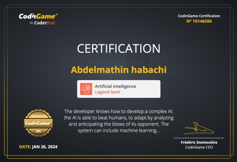
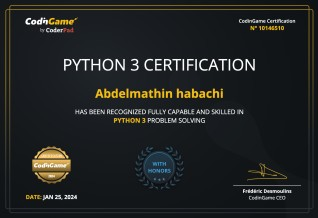
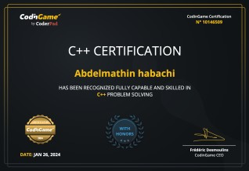

# 👋 Hi, I'm Abdelmathin Habachi

**AI Software Engineer | Python Developer | Cloud Infrastructure Specialist**  
_Transforming ideas into scalable, efficient solutions._

Welcome to my GitHub profile! ❤️

I'm <a href="http://abdelmathin.com/">Abdelmathin</a>, a software engineer with strong expertise in backend development, cloud infrastructure, and AI/ML solutions. As a problem solver and proud member of the <a href="https://www.42network.org">42 Network</a> and <a href="https://www.linkedin.com/school/1337-coding-school">1337 Coding School</a>, I’m driven to explore cutting-edge technologies and create impactful solutions.

---

### 🚀 **What I Do**

- **Backend Development:**  
  I specialize in building robust APIs, microservices, and scalable backend systems using **Python** (Django, Flask), **Java** (Spring Boot), and **C++**. I focus on writing clean, maintainable code that powers businesses.

- **Cloud & DevOps:**  
  With extensive experience in **AWS**, **Docker**, **Kubernetes**, **Terraform**, and **CI/CD pipelines**, I help automate infrastructure, ensure scalability, and manage cloud environments for seamless deployments.

- **AI & Machine Learning:**  
  I integrate AI/ML models into applications to solve complex problems, from predictive analytics to automation solutions.

---

### 🎖️ **Certificates**

<table>
   <tr height="320px">
      <!-- start item -->
      <td>
         <table>
            <tr>
               <td colspan="4">
               <a href="https://www.codingame.com/certification/DmACdf5hCdT9pMiLeoVZtg">
                </a></td>
            </tr>
            <tr />
            <tr>
               <td width="220px" height="110px" vertical-align="top" colspan="4">
                <a href="https://www.codingame.com/certification/DmACdf5hCdT9pMiLeoVZtg"><strong>AI certificate</strong></a>, awarded for completing an AI challenge.
               </td>
            </tr>
            <tr />
            <tr>
               <td align="center">
                  <a href="https://www.codingame.com/certification/DmACdf5hCdT9pMiLeoVZtg">
                     <picture>
                        <source media="(prefers-color-scheme: light)" srcset="./docs/assets/icons/icon-demo-light.svg" />
                        <source media="(prefers-color-scheme: dark)" srcset="./docs/assets/icons/icon-demo-dark.svg" />
                        
                     </picture>
                  </a>
               </td>
               <td align="center">
                  <a href="https://www.codingame.com/certification/DmACdf5hCdT9pMiLeoVZtg">
                     <picture>
                        <source media="(prefers-color-scheme: light)" srcset="./docs/assets/icons/icon-pdf-light.svg" />
                        <source media="(prefers-color-scheme: dark)" srcset="./docs/assets/icons/icon-pdf-dark.svg" />
                        
                     </picture>
                  </a>
               </td>
               <td align="center">
                  <a href="https://www.codingame.com/certification/DmACdf5hCdT9pMiLeoVZtg">
                     <picture>
                        <source media="(prefers-color-scheme: light)" srcset="./docs/assets/icons/icon-github-light.svg" />
                        <source media="(prefers-color-scheme: dark)" srcset="./docs/assets/icons/icon-github-dark.svg" />
                        
                     </picture>
                  </a>
               </td>
            </tr>
         </table>
      </td>
      <!-- end item -->
      <!-- start item -->
      <td>
         <table>
            <tr>
               <td colspan="4">
               <a href="https://www.codingame.com/certification/bkyw-Swchj50O3zvzPhwOw">
                </a></td>
            </tr>
            <tr />
            <tr>
               <td width="220px" height="110px" vertical-align="top" colspan="4">
                <a href="https://www.codingame.com/certification/bkyw-Swchj50O3zvzPhwOw"><strong>Python certificate</strong></a>, awarded for completing an Python challenge.
               </td>
            </tr>
            <tr />
            <tr>
               <td align="center">
                  <a href="https://www.codingame.com/certification/bkyw-Swchj50O3zvzPhwOw">
                     <picture>
                        <source media="(prefers-color-scheme: light)" srcset="./docs/assets/icons/icon-demo-light.svg" />
                        <source media="(prefers-color-scheme: dark)" srcset="./docs/assets/icons/icon-demo-dark.svg" />
                        
                     </picture>
                  </a>
               </td>
               <td align="center">
                  <a href="https://www.codingame.com/certification/bkyw-Swchj50O3zvzPhwOw">
                     <picture>
                        <source media="(prefers-color-scheme: light)" srcset="./docs/assets/icons/icon-pdf-light.svg" />
                        <source media="(prefers-color-scheme: dark)" srcset="./docs/assets/icons/icon-pdf-dark.svg" />
                        
                     </picture>
                  </a>
               </td>
               <td align="center">
                  <a href="https://www.codingame.com/certification/bkyw-Swchj50O3zvzPhwOw">
                     <picture>
                        <source media="(prefers-color-scheme: light)" srcset="./docs/assets/icons/icon-github-light.svg" />
                        <source media="(prefers-color-scheme: dark)" srcset="./docs/assets/icons/icon-github-dark.svg" />
                        
                     </picture>
                  </a>
               </td>
            </tr>
         </table>
      </td>
      <!-- end item -->
      <!-- start item -->
      <td>
         <table>
            <tr>
               <td colspan="4">
               <a href="https://www.codingame.com/certification/_jOvCzTzOLXJVHIMnk1ZeQ">
                </a></td>
            </tr>
            <tr />
            <tr>
               <td width="220px" height="110px" vertical-align="top" colspan="4">
                <a href="https://www.codingame.com/certification/_jOvCzTzOLXJVHIMnk1ZeQ"><strong>C++ certificate</strong></a>, awarded for completing an C++ challenge.
               </td>
            </tr>
            <tr />
            <tr>
               <td align="center">
                  <a href="https://www.codingame.com/certification/_jOvCzTzOLXJVHIMnk1ZeQ">
                     <picture>
                        <source media="(prefers-color-scheme: light)" srcset="./docs/assets/icons/icon-demo-light.svg" />
                        <source media="(prefers-color-scheme: dark)" srcset="./docs/assets/icons/icon-demo-dark.svg" />
                        
                     </picture>
                  </a>
               </td>
               <td align="center">
                  <a href="https://www.codingame.com/certification/_jOvCzTzOLXJVHIMnk1ZeQ">
                     <picture>
                        <source media="(prefers-color-scheme: light)" srcset="./docs/assets/icons/icon-pdf-light.svg" />
                        <source media="(prefers-color-scheme: dark)" srcset="./docs/assets/icons/icon-pdf-dark.svg" />
                        
                     </picture>
                  </a>
               </td>
               <td align="center">
                  <a href="https://www.codingame.com/certification/_jOvCzTzOLXJVHIMnk1ZeQ">
                     <picture>
                        <source media="(prefers-color-scheme: light)" srcset="./docs/assets/icons/icon-github-light.svg" />
                        <source media="(prefers-color-scheme: dark)" srcset="./docs/assets/icons/icon-github-dark.svg" />
                        
                     </picture>
                  </a>
               </td>
            </tr>
         </table>
      </td>
      <!-- end item -->
   </tr>
</table>

---

### 🛠 **My Tech Toolbox**

```python
class AbdelmathinToolbox:
    def __init__(self):
        self.languages    = ["Python", "Java", "C++", "C", "JavaScript", "Bash"]
        self.frameworks   = ["Spring Boot", "Django", "Flask", "ReactJS"]
        self.cloud_devops = ["AWS", "Docker", "Terraform", "K3d", "ArgoCD", "GitHub Actions"]
        self.databases    = ["MariaDB", "MySQL", "PostgreSQL"]
        self.other_skills = ["AI/ML", "CI/CD", "Git"]
    
    def work(self):
        print("Building scalable solutions with top-notch technology 🚀")

    def take_a_break(self):
        print("Grabbing a coffee ☕ while AI handles the rest!")

# Activate the toolbox
abdelmathin = AbdelmathinToolbox()
abdelmathin.work()
```

---

Explore my repositories to see more of what I'm working on and contributing to the open-source community.

---

### 🏆 **Achievements**

- Top Scorer of the Programming Tournament at **1337 Coding School**, with **59392** points in 2024!
- Ranked **57th globally** in the Codingame Fall Challenge 2023.
- Created solutions for the **CPC Bootcamp** and **CSES Problem Set**, showcasing problem-solving skills in C++ and Python.
- Built a **client-server encryption** project with C++ and separate encryption/decryption executables.

---

### 📬 **Let's Connect**

I'm always open to new opportunities and collaborations. Feel free to reach out via any of the platforms below:

- **[Fiverr](https://www.fiverr.com/abdelmathin)**
- **[Upwork](https://www.upwork.com/freelancers/~01641d1e04ff7c3fad?mp_source=share)**
- **[LinkedIn](https://www.linkedin.com/in/abdelmathin/)**
- **[Freelancer](https://www.freelancer.com/u/ahabachi)**

---

### ⚡ **Fun Fact**

When I'm not coding, you can find me exploring the latest in AI, solving competitive programming challenges, or tinkering with cloud infrastructure.  
"Turning complex problems into simple, elegant solutions is my favorite kind of challenge."

---


<!--
**Abdelmathin/abdelmathin** is a ✨ _special_ ✨ repository because its `README.md` (this file) appears on your GitHub profile.

Here are some ideas to get you started:

- 🔭 I’m currently working on ...
- 🌱 I’m currently learning ...
- 👯 I’m looking to collaborate on ...
- 🤔 I’m looking for help with ...
- 💬 Ask me about ...
- 📫 How to reach me: ...
- 😄 Pronouns: ...
- ⚡ Fun fact: ...


https://www.fiverr.com/abdelmathin

https://www.upwork.com/freelancers/~01641d1e04ff7c3fad?mp_source=share

https://www.linkedin.com/in/abdelmathin/

https://www.freelancer.com/u/ahabachi


https://www.toptal.com/screening_wizard/application


## 🧑‍💻 About Me

- **Age:** 26
- **Education:** 
  - Computer Science student at 1337
  - Licensed in Physique et Chimie and Sciences de la Vie et de la Terre
  - DUT in Agro-Alimentary from the École Supérieure de Technologie
- **Experience:** Over 8 years of programming experience
- **Languages:** Java, Python, C++, Objective-C

---


https://github.com/Thaiane/Thaiane
https://github.com/MarikIshtar007/MarikIshtar007


-->
